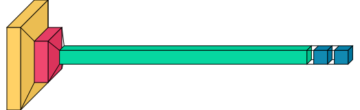

# Tugas EAS-GENAP Kelompok 9

nama anggota:
- Ahmad Farhan (02311940000079)
- Ilham Nurfalaq (02311940000127)
- Kiky Agustina Putri (02311940000047)
- Bima Prasetya (023119400000091)
- Muhammad Chairusya (02311940000162)

## Deteksi Gambar yang di hasilkan AI generator

kemajuan AI yang booming pada akhir-akhir ini menimbulkan beberapa kontroversi dikalangan seniman, ataupun fotografer, dengan beberapa klik, dan hardware yang memadai kita bisa dengan mudah menghasilkan gambar yang membutuhkan waktu berjam-jam untuk menyelesaikannya, dengan keresahan para seniman, dan fotografer, ada insentif dalam mengkampanyekan dan menekan media agar tetap menyewa seniman, dan fotografer asli, dibanding menggunakan AI generator yang merugikan pendapatan seniman, dan fotografer, maka kelompok kami mencoba membuat model machine learning CNN yang dapat digunakan untuk mengklasifikasikan gambar yang ada merupakan gambar asli, ataupun gambar yang di generasi oleh AI generator. 

## Metode: CNN, lm

pada tugas ini kelompok kami memilih untuk menggunakan algoritma levenberg-marquadt, dan kita juga melatih dengan algoritma umum(orde 1) untuk perbandingan, kita menggunakan library TensorFlow, dan model dilatih dengan gpu RTX 3060

### Arsitektur JST

layer yang kita buat sangat sederhana, dengan satu layer convolution, satu layer maxpooling, flatte, dan diikuti dense, dan output, semua layer menggunakan aktivasi ReLu, kecuali untuk layer terakhir yang menentukan klasifikasi biner, dengan aktivasi sigmoid

## Acknowledgement

we give a big thanks to Fabiodimarco for his repositories on implementing lm algorithm using tensorflow, anyone can hit up his repos for the full usage
https://github.com/fabiodimarco/tf-levenberg-marquardt.git

dataset cite source:

https://www.kaggle.com/datasets/birdy654/cifake-real-and-ai-generated-synthetic-images

Krizhevsky, A., & Hinton, G. (2009). Learning multiple layers of features from tiny images.

Bird, J.J., Lotfi, A. (2023). CIFAKE: Image Classification and Explainable Identification of AI-Generated Synthetic Images. arXiv preprint arXiv:2303.14126.

